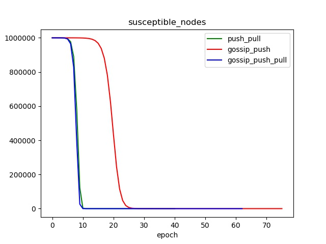

# 分布式系统导论作业

## 个人信息

`姓名` 徐啸

`班级` 软工1604

`学号` 20164999

## 作业概述

- 实现基于`push_pull`(`exchange`)和`Gossip`的求平均值程序
    - 实现基于`push`的和基于`push_pull`的`Gossip`算法
- 实现基于反熵算法的更新效果检测

## 实现细节
### 反熵算法
- 初始化：1,000,000 个节点，初始值为 0，随机选取一个节点为1，检测三种算法传播到所有节点的速度。
- 结束条件：均以所有节点变为1为结束条件。

### 求平均值
- 初始化：1,000,000 个节点，初始值为 0 ~ 999,999，建立state数组保存节点的状态信息
    - `state`数组中，`-1` 表示已隔离状态，`0` 表示易感染状态，`1` 表示已感染状态，`0 ~ 1`之间的浮点数值表示兴趣衰减状态。
- 结束条件：
    - `push_pull`：标准差小于0.001时结束传播
    - 基于`push`的和基于`push_pull`的`Gossip`算法：所有节点均为已隔离或易感染状态。

## 结果概述
### 反熵算法


- 从如上两张曲线图可以得出，push、pull与push_pull分别在34、19和12次迭代时完成全体更新。
  - 对于每次迭代的更新次数，push_pull要比pull和push更加快速的达到峰值并且峰值更高。
- 对于运算时间，push_pull也比pull与push要更短。

```
push time diff =  23.19695281982422
pull time diff =  22.219600677490234
push_pull time diff =  20.229918241500854
```

### 求平均值





- 如上四张图分别描述了三种算法求平均值的标准差变化、易感染节点数变化、更新次数变化、已隔离节点数变化。
  - push_pull、基于push的Gossip和基于push_pull的Gossip分别在40、75和62次迭代时停止迭代
  - 基于`push_pull`的`Gossip`在标准差降低和易感染节点数降低上比另外两种算法要更快
  - 对于每次迭代的更新次数，基于`push_pull`的`Gossip`要比另外两种算法更加快速的达到峰值。
  - 对于已隔离节点数的变化，基于`push_pull`的`Gossip`算法要比基于`push`的`Gossip`算法更快达到峰值
- 对于运算时间，基于`push_pull`的`Gossip`也比另外两种算法要更短。

```
push_pull time diff =  550.8045172691345
gossip_push time diff =  483.12159991264343
gossip_push_pull time diff =  456.8370683193207
```

## 目录结构

```
卷 新加卷 的文件夹 PATH 列表
卷序列号为 989A-E9E0
E:.
│  anti_entropy.log							反熵算法的控制台输出记录
│  anti_entropy.py                          反熵算法源码（包括push、pull、push_pull三种算法的布尔值的更新效果检测）
│  anti_entropy_infected_nodes.jpg          反熵算法_已感染节点的变化曲线
│  anti_entropy_update_times.jpg            反熵算法_每次迭代的更新次数曲线
│  average.log								求平均值的控制台输出记录
│  average.py                               求平均值源码（包括push_pull、基于push的Gossip、基于push_pull的Gossip三种算法）
│  average_removed_nodes.jpg                求平均值_已隔离节点的变化曲线
│  average_std.jpg                          求平均值_标准差的变化曲线
│  average_susceptible_nodes.jpg            求平均值_易感染节点的变化曲线
│  average_update_times.jpg                 求平均值_每次迭代的更新次数曲线
│  history.json                             反熵算法的过程数据（绘图用）
│  history_average.json                     求平均值的过程数据（绘图用）
│  ReadMe.md								说明文件
│  time.log                                 各算法的耗时记录（单位微秒）
│  tree.txt                                 工程结构树文件
│  
└─.idea                                     PyCharm工程文件夹
    │  encodings.xml
    │  Gossip.iml
    │  misc.xml
    │  modules.xml
    │  workspace.xml
    │  
    └─inspectionProfiles
            Project_Default.xml
```